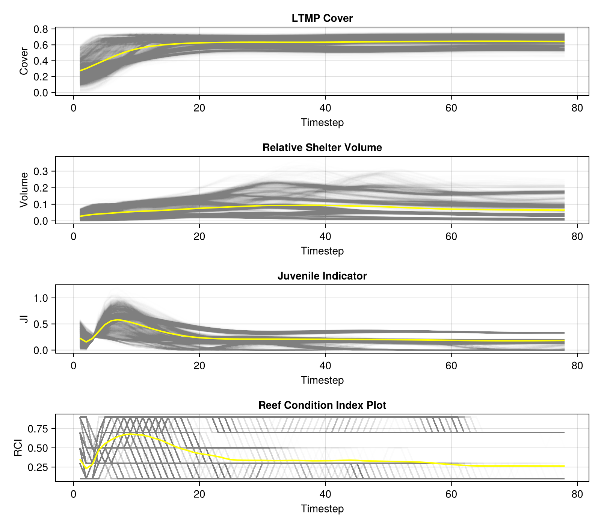

# ADRIAIndicators.jl

ADRIAIndicators.jl is a Julia package for summarizing outputs from coral reef ecological
models. Its primary purpose is to provide a standardized and dependency-free package for
transforming high-dimensional model outputs such as coral abundance by reef, time,
species, and size class into lower-dimensional, interpretable metrics.

The package offers a wide range of functions, from simple aggregations and unit
conversions to more complex indices and estimators derived from regression models.
These tools help with the estimation of functional diversity, juvenile abundance,
shelter volume, fish biomass, and overall reef condition, enabling consistent and
comparable analysis across different coral ecology models.


## Usage

The following example demonstrates a typical workflow for calculating the Reef Condition Index (RCI) from raw model outputs.

```julia
using ADRIAIndicators

# 1. Define model outputs and parameters.
# These are assumed to be pre-loaded or defined externally.

# Main model output: 4D array of relative coral cover.
# Dimensions: [timesteps, groups, sizes, locations]
relative_cover::Array{Float64, 4} = ...

# Vector of habitable area in m² for each location.
# Dimensions: [locations]
habitable_area::Vector{Float64} = ...

# Vector of total reef area in m² for each location.
# Dimensions: [locations]
reef_area::Vector{Float64} = ...

# Boolean vector indicating which size classes are considered juvenile.
# Length must match the number of size classes.
is_juvenile::Vector{Bool} = [true, true, false, ...]

# Matrix of mean colony diameters in cm for each functional group and size class.
# Dimensions: [groups, sizes]
mean_colony_diameters::Matrix{Float64} = [
    5.0, 10.0, ...;
    4.0, 11.0, ...;
    ...
]

# 3D array of parameters (intercept, coefficient) for the log-log planar area model.
# Dimensions: [groups, sizes, 2]
planar_area_params::Array{Float64, 3} = ...
# The planar area parameterisation used for Tabular Acropora in CoralBlox.jl is
# intercept = -8.95 and slope = 2.8 derived from [Aston et al., 2022]


# A scalar representing the maximum possible density of juveniles (individuals/m²).
max_juv_density::Float64 = 15.0
```

```julia

# 2. Calculate intermediate metrics required for the RCI.

# (a) LTMP Cover
ltmp_cover = ADRIAIndicators.ltmp_cover(relative_cover, habitable_area, reef_area)

# (b) Relative Shelter Volume
# First, calculate 4D shelter volume, then aggregate to 2D [timesteps, locations].
sv_4d = ADRIAIndicators.relative_shelter_volume(relative_cover, mean_colony_diameters, planar_area_params, habitable_area)
relative_shelter_volume = dropdims(sum(sv_4d, dims=(2, 3)), dims=(2, 3))

# (c) Juvenile Indicator
juvenile_indicator = ADRIAIndicators.juvenile_indicator(relative_cover, is_juvenile, habitable_area, mean_colony_diameters ./ 100, max_juv_density)

# 3. Calculate the final Reef Condition Index.
rci = ADRIAIndicators.reef_condition_index(ltmp_cover, relative_shelter_volume, juvenile_indicator)
```

Each metric also has an in-place version (ending in `!`) that accepts a pre-allocated output array. This is useful for performance-critical code or for integrating with other languages like Python or R where memory may not be managed by the Julia runtime.

## Example Plot

The following is an example plot generated from the metrics, showing the mean trend of several key indicators over time against the variation of all locations. They are the model results of `CoralBlox.jl` with no environmental disturbances and toy parameters.



## Available Metrics

- [Relative/Absolute/LTMP Cover](@ref "Cover Metrics")
- [Relative/Absolute Shelter Volume](@ref "Metrics")
- [Relative/Absolute Juveniles](@ref "Juvenile Metrics")
- [Juvenile Indicator](@ref "Juvenile Metrics")
- [Coral Diversity](@ref "Metrics")
- [Coral Evenness](@ref "Metrics")
- [Reef Indices](@ref "Reef Indices")

## Building Documentation

The documentation is hosted online but can also be built locally for offline use or development purposes.

First, ensure you have the project dependencies installed:
```bash
cd docs
julia --project=. -e 'using Pkg; Pkg.instantiate()'
```

Then, build the documentation:
```bash
julia --project=. make.jl
```

Finally, open `index.html` in the `docs/build` directory to view the documentation.
